---
lab:
  title: Laden von transformierten Daten in Power BI Desktop
  module: 'Clean, Transform, and Load Data in Power BI'
---

# Laden von transformierten Daten in Power BI Desktop

## **Labszenario**

In diesem Lab verwenden Sie Datenbereinigungs- und Transformationstechniken, um mit der Strukturierung Ihres Datenmodells zu beginnen. Anschließend werden Sie jede einzelne Abfrage als Tabelle in das Datenmodell laden.

In diesem Lab lernen Sie Folgendes:

- Anwenden verschiedener Transformationen
- Laden von Abfragen in das Datenmodell

**Dieses Lab sollte ungefähr 45 Minuten in Anspruch nehmen.**

## **Erste Schritte**

In dieser Aufgabe richten Sie die Umgebung für das Lab ein.

*Wichtig: Wenn Sie das vorherige Lab auf demselben virtuellen Computer abgeschlossen haben, fahren Sie mit der nächsten Aufgabe fort.*

1. Öffnen Sie Power BI Desktop.

    *Tipp: Standardmäßig wird das Dialogfeld „Erste Schritte“ vor Power BI Desktop geöffnet. Sie können sich anmelden und dann das Popup schließen.*

    

1. Um die Power BI Desktop-Startdatei zu öffnen, wählen Sie **Datei > Bericht öffnen > Berichte durchsuchen** aus.

1. Navigieren Sie im Fenster **Öffnen** zum Ordner **C:\PL300\Labs\02-load-data-with-power-query-in-power-bi-desktop\Starter**, und öffnen Sie die Datei **Verkaufsanalyse**.

1. Schließen Sie alle Informationsfenster, die möglicherweise geöffnet werden.

1. Beachten Sie die gelbe Warnmeldung unterhalb des Menübands.

    *In dieser Meldung werden Sie darauf hingewiesen, dass die Abfragen nicht als Modelltabellen geladen wurden. Sie wenden die Abfragen später in diesem Lab an.*

    Klicken Sie rechts auf der gelben Warnmeldung auf das **X**, um die Warnmeldung zu verwerfen.

1. Um eine Kopie der Datei zu erstellen, wechseln Sie zu **Datei > Speichern unter**, und speichern Sie sie im Ordner **C:\PL300\MySolution**.

1. Wenn Sie aufgefordert werden, Änderungen zu übernehmen, klicken Sie auf **Später übernehmen**.

## **Konfigurieren der „Salesperson“-Abfrage**

In dieser Aufgabe verwenden Sie den Power Query-Editor zum Konfigurieren der **Salesperson**-Abfrage.

*Wichtig: Wenn Sie aufgefordert werden, Spalten umzubenennen, ist es wichtig, dass Sie genauso wie beschrieben vorgehen.*

1. Klicken Sie auf der Registerkarte **Start** des Menübands in der Gruppe **Abfragen** auf das Symbol **Daten transformieren**, um das Fenster **Power Query-Editor** zu öffnen.

     

1. Wählen Sie im Fenster **Power Query-Editor** im Bereich **Abfragen** die Abfrage **DimEmployee** aus.

     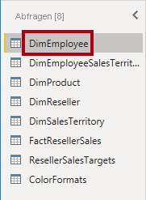

1. Ersetzen Sie zum Umbenennen der Abfrage im Bereich **Abfrageeinstellungen** (rechts) den Text im Feld **Name** durch **Salesperson**, und drücken Sie die **EINGABETASTE**. Überprüfen Sie dann, ob der Name im Bereich**Abfragen** aktualisiert wurde.

    *Der Name der Abfrage bestimmt den Namen der Modelltabelle. Es wird empfohlen, präzise und benutzerfreundliche Namen zu definieren.*

1. Klicken Sie zum Suchen einer bestimmten Spalte auf der Registerkarte **Start** des Menübands auf den Nach-unten-Pfeil der Menüoption **Spalten verwalten** und dann auf den Nach-unten-Pfeil der Menüoption **Spalten auswählen**. Klicken Sie anschließend auf **Zu Spalte wechseln**.

    *„Zur Spalte wechseln“ ist bei vielen Spalten ein nützliches Feature. Andernfalls können Sie horizontal nach Spalten scrollen.*

     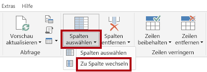

1. Klicken Sie im Fenster **Zur Spalte wechseln** auf die Sortierschaltfläche **AZ**, um die Liste nach Spaltennamen zu sortieren, und klicken Sie dann auf **Name** und auf **SalesPersonFlag**. Klicken Sie auf **OK**.

     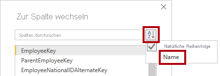

1. Suchen Sie die Spalte **SalesPersonFlag** , filtern Sie dann die Spalte, um nur Verkaufspersonal (d. h. **TRUE**) auszuwählen, und klicken Sie auf **OK**.

1. Beachten Sie im Bereich **Abfrageeinstellungen** in der Liste **Angewendete Schritte**, dass der Schritt **Gefilterte Zeilen** hinzugefügt wurde.

    *Jede Transformation, die Sie erstellen, führt zu einer weiteren Schrittlogik. Schritte können auch bearbeitet oder gelöscht werden. Es ist ebenso möglich, einen Schritt auszuwählen und eine Vorschau der Abfrageergebnisse in dieser Phase der Abfragetransformation anzuzeigen.*

     

1. Klicken Sie auf der Registerkarte **Start** des Menübands in der Gruppe **Spalten verwalten** auf das Symbol **Spalten auswählen**, um Spalten zu entfernen.

1. Deaktivieren Sie im Fenster **Spalten auswählen** das Element **(Alle Spalten auswählen)**, um alle Spalten zu deaktivieren.

1. Damit Spalten berücksichtigt werden, müssen Sie die Kontrollkästchen für folgenden sechs Spalten aktivieren:

    - EmployeeKey
    - EmployeeNationalIDAlternateKey
    - FirstName
    - LastName
    - Title
    - EmailAddress

1. Beachten Sie in der Liste **Angewendete Schritte**, dass ein weiterer Abfrageschritt hinzugefügt wurde.

     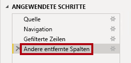

1. Klicken Sie zuerst auf die Spaltenüberschrift **FirstName**, um eine einzelne Namensspalte zu erstellen. Klicken Sie auf die Spalte **LastName**, während Sie **STRG** gedrückt halten.

     

1. Klicken Sie mit der rechten Maustaste auf eine der markierten Spaltenüberschriften, und wählen Sie dann im Kontextmenü **Spalten zusammenführen** aus.

    *Viele gängige Transformationen können angewandt werden, indem Sie mit der rechten Maustaste auf die Spaltenüberschrift klicken und die Transformation im Kontextmenü auswählen. Beachten Sie jedoch, dass im Menüband mehr Transformationen verfügbar sind.*

1. Wählen Sie im Fenster **Spalten zusammenführen** in der Dropdownliste **Trennlinie** die Option **Leertaste** aus.

1. Ersetzen Sie im Feld **Neuer Spaltenname** den Text durch **Salesperson**.

1. Um die Spalte **EmployeeNationalIDAlternateKey** umzubenennen, doppelklicken Sie auf die Spaltenüberschrift **EmployeeNationalIDAlternateKey**, ersetzen Sie den Text durch **EmployeeID**, und drücken Sie dann die **Eingabetaste**.

1. Führen Sie die vorherigen Schritte noch einmal aus, um die Spalte **EmailAddress** in **UPN** umzubenennen.

    *Das Akronym „UPN“ steht für „User Principal Name“, zu Deutsch: „Benutzerprinzipalname“.*

1. Überprüfen Sie links unten auf der Statusleiste, ob die Abfrage fünf Spalten und 18 Zeilen enthält.

## **Konfigurieren der „SalespersonRegion“-Abfrage**

In dieser Aufgabe konfigurieren Sie die **SalespersonRegion**-Abfrage.

1. Wählen Sie im Bereich **Abfragen** die Abfrage **DimEmployeeSalesTerritory** aus.

1. Benennen Sie die Abfrage im Bereich **Abfrageeinstellungen** in **SalespersonRegion** um.

1. Wählen Sie zuerst die Spaltenüberschrift **DimEmployee** aus, um die letzten zwei Spalten zu entfernen.

1. Halten Sie **STRG** gedrückt, und klicken Sie dann auf die Spaltenüberschrift **DimSalesTerritory**.

1. Klicken Sie mit der rechten Maustaste auf eine der markierten Spaltenüberschriften, und wählen Sie dann im Kontextmenü **Spalten entfernen** aus.

1. Überprüfen Sie auf der Statusleiste, ob die Abfrage zwei Spalten und 39 Zeilen enthält.

## **Konfigurieren der Product-Abfrage**

In dieser Aufgabe konfigurieren Sie die Abfrage **Product**.

*Wichtig: Da bereits ausführliche Anweisungen bereitgestellt wurden, enthalten die Schritte zum Lab kürzere Anweisungen. Wenn Sie die ausführlichen Anweisungen benötigen, können Sie zu den Schritten der vorherigen Aufgaben zurückkehren.*

1. Wählen Sie die **DimProduct**-Abfrage aus, und benennen Sie die Abfrage in **Product** um.

1. Suchen Sie die Spalte **FinishedGoodsFlag**, und filtern Sie dann die Spalte, um Produkte abzurufen, bei denen es sich um fertiggestellte Waren handelt (d. h. sie weisen den Wert TRUE auf).

1. Entfernen Sie alle Spalten, **außer** den folgenden:

    - ProductKey
    - EnglishProductName
    - StandardCost
    - Color
    - DimProductSubcategory

1. Beachten Sie, dass die Spalte **DimProductSubcategory** eine verknüpfte Tabelle ist (sie enthält **Value**-Verknüpfungen).

1. Klicken Sie in der Spaltenüberschrift **DimProductSubcategory** rechts neben dem Spaltennamen auf die Schaltfläche „Erweitern“.

    

1. Sehen Sie sich die vollständige Liste der Spalten an, und wählen Sie dann das Feld **Alle Spalten auswählen** aus, um die Auswahl aller Spalten aufzuheben.
2. Wählen Sie **EnglishProductSubcategoryName** und **DimProductCategory** aus, und deaktivieren Sie das Kontrollkästchen **Originalspaltennamen als Präfix verwenden**, bevor Sie **OK** auswählen.

    *Indem Sie diese zwei Spalten auswählen, wird eine Transformation für eine Verknüpfung mit der Tabelle **DimProductSubcategory** durchgeführt. Daraufhin werden diese Spalten eingefügt. Bei der Spalte **DimProductCategory** handelt es sich tatsächlich um eine andere verknüpfte Tabelle in der Datenquelle.*

    *Abfragespaltennamen müssen immer eindeutig sein. Wenn das Kontrollkästchen aktiviert ist, wird der erweiterte Spaltenname allen Spalten als Präfix vorangestellt (in diesem Fall **DimProductSubcategory**). Da bekannt ist, dass die ausgewählten Spalten keinen Konflikt mit den Spalten in der Abfrage **Product** auslösen, ist diese Option deaktiviert.*

1. Beachten Sie, dass die Transformation dazu geführt hat, dass zwei Spalten hinzugefügt wurden und dass die Spalte **DimProductSubcategory** entfernt wurde.

1. Erweitern Sie die Spalte **DimProductCategory**, und führen Sie dann nur die Spalte **EnglishProductCategoryName** ein.

1. Benennen Sie die folgenden vier Spalten um:

    - **EnglishProductName** in **Product**
    - **StandardCost** in **Standard Cost** (fügen Sie ein Leerzeichen ein)
    - **EnglishProductSubcategoryName** in **Subcategory**
    - **EnglishProductCategoryName** in **Category**

1. Überprüfen Sie in der Statusleiste, ob die Abfrage 6 Spalten und 397 Zeilen enthält.

## **Konfigurieren der Reseller-Abfrage**

In dieser Aufgabe konfigurieren Sie die Abfrage **Reseller**.

1. Wählen Sie die Abfrage **DimReseller** aus, und benennen Sie sie in **Reseller** um.

1. Entfernen Sie alle Spalten, **außer** den folgenden:

    - ResellerKey
    - BusinessType
    - ResellerName
    - DimGeography

1. Erweitern Sie die Spalte **DimGeography** so, dass **nur** die folgenden drei Spalten enthalten sind:

    - City
    - StateProvinceName
    - EnglishCountryRegionName

1. Klicken Sie in der Spaltenüberschrift **BusinessType** auf den Pfeil nach unten, und überprüfen Sie dann die einzelnen Spaltenwerte. Beachten Sie die unterschiedliche Schreibweise von **Warehouse** und **Ware House**.

1. Klicken Sie mit der rechten Maustaste auf die Spaltenüberschrift **Business Type**, und wählen Sie dann **Werte ersetzen** aus.

1. Konfigurieren Sie im Fenster **Werte ersetzen** die folgenden Werte:

    - Geben Sie in das Feld **Zu suchender Wert** **Ware House** ein.
    - Geben Sie in das Feld **Ersetzen durch** **Warehouse** ein.

     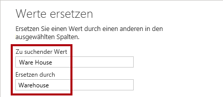

1. Benennen Sie die folgenden vier Spalten um:

    - **BusinessType** in **Business Type** (fügen Sie ein Leerzeichen ein)
    - **ResellerName** in **Reseller**
    - **StateProvinceName** in **State-Province**
    - **EnglishCountryRegionName** in **Country-Region**

1. Überprüfen Sie auf der Statusleiste, ob die Abfrage sechs Spalten und 701 Zeilen enthält.

## **Konfigurieren der Region-Abfrage**

In dieser Aufgabe konfigurieren Sie die Abfrage **Region**.

1. Wählen Sie die Abfrage **DimSalesTerritory** aus, und benennen Sie die Abfrage in **Region** um.

1. Wenden Sie einen Filter auf die Spalte **SalesTerritoryAlternateKey** an, um den Wert 0 (null) zu entfernen.

    *Dadurch wird eine Zeile entfernt.*

1. Entfernen Sie alle Spalten, **außer** den folgenden:

    - SalesTerritoryKey
    - SalesTerritoryRegion
    - SalesTerritoryCountry
    - SalesTerritoryGroup

1. Benennen Sie die folgenden drei Spalten um:

    - **SalesTerritoryRegion** in **Region**
    - **SalesTerritoryCountry** in **Country**
    - **SalesTerritoryGroup** in **Group**

1. Überprüfen Sie auf der Statusleiste, ob die Abfrage vier Spalten und zehn Zeilen enthält.

## **Konfigurieren der Sales-Abfrage**

In dieser Aufgabe konfigurieren Sie die Abfrage **Sales**.

1. Wählen Sie die Abfrage **FactResellerSales** aus, und benennen Sie sie in **Sales** um.

1. Entfernen Sie alle Spalten, **außer** den folgenden:

    - SalesOrderNumber
    - OrderDate
    - ProductKey
    - ResellerKey
    - EmployeeKey
    - SalesTerritoryKey
    - OrderQuantity
    - UnitPrice
    - TotalProductCost
    - SalesAmount
    - DimProduct

        *Hinweis: Möglicherweise erinnern Sie sich daran, dass im Lab **Vorbereiten von Daten in Power BI Desktop** in den Zeilen **FactResellerSales** ein kleiner Prozentsatz an Werten von **TotalProductCost** fehlte. Die Spalte **DimProduct** wurde hinzugefügt, um die Spalten mit den Standardproduktkosten abzurufen und so die fehlenden Werte zu ergänzen.*

1. Erweitern Sie die Spalte **DimProduct**, deaktivieren Sie alle Spalten, und fügen Sie dann nur die Spalte **StandardCost** hinzu.

1. Klicken Sie zum Erstellen einer benutzerdefinierten Spalte auf der Registerkarte **Spalte hinzufügen** des Menübands in der Gruppe **Allgemein** auf **Benutzerdefinierte Spalte**.

     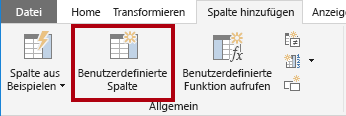

1. Ersetzen Sie im Fenster **Benutzerdefinierte Spalte** im Feld **Neuer Spaltenname** den Text durch **Cost**.

1. Geben Sie im Feld **Benutzerdefinierte Spaltenformel** den folgenden Ausdruck ein (nach dem Gleichheitszeichen):
    - *Sie können den Ausdruck aus der Datei **C:\PL300\Labs\02-load-data-with-power-query-in-power-bi-desktop\Assets\Snippets.txt** kopieren.*
    - *Mit diesem Ausdruck wird getestet, ob der Wert für **TotalProductCost** fehlt. Wenn er fehlt, wird durch Multiplizieren der Werte für **OrderQuantity** und **StandardCost** ein Wert erzeugt. Andernfalls wird der vorhandene Wert für **TotalProductCost** verwendet.*

    `
    if [TotalProductCost] = null then [OrderQuantity] * [StandardCost] else [TotalProductCost]
    `

1. Entfernen Sie die beiden folgenden Spalten:

    - TotalProductCost
    - StandardCost

1. Benennen Sie die folgenden drei Spalten um:

    - **OrderQuantity** in **Quantity**
    - **UnitPrice** in **Unit Price** (Ergänzen eines Leerzeichens)
    - **SalesAmount** in **Sales**

1. Klicken Sie zum Ändern des Datentyps in der Spaltenüberschrift **Quantity** links neben dem Spaltennamen auf das Symbol **1.2**, und wählen Sie **Ganze Zahl** aus.

    *Es ist wichtig, den richtigen Datentyp zu konfigurieren. Wenn die Spalte einen numerischen Wert enthält, ist es auch wichtig, den richtigen Typ auszuwählen, wenn Sie planen, mit dem Wert mathematische Berechnungen durchzuführen.*

     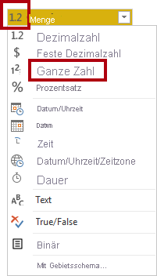

1. Ändern Sie bei den folgenden drei Spalten den Datentyp in **Feste Dezimalzahl**.

    *Der feste Dezimalzahl-Datentyp lässt 19 Ziffern zu und ermöglicht eine höhere Genauigkeit zu, um Rundungsfehler zu vermeiden. Es ist wichtig, den festen Dezimalzahlentyp für Finanzwerte oder Kurse (z. B. Wechselkurse) zu verwenden.*

    - Unit Price
    - Sales
    - Cost

1. Überprüfen Sie in der Statusleiste, ob die Abfrage 10 Spalten und 999 Zeilen enthält.

    *Maximal 1000 Zeilen werden als Vorschaudaten für jede Abfrage geladen.*

## **Konfigurieren der Abfrage „Targets“**

In dieser Aufgabe konfigurieren Sie die Abfrage **Targets**.

1. Wählen Sie die Abfrage **ResellerSalesTargets** aus, und benennen Sie sie in **Targets** um.

1. Wählen Sie zum Entpivotieren der 12 Monatsspalten (**M01**-**M12**) zunächst gleichzeitig die Überschriften der Spalten **Year** und **EmployeeID** aus.

1. Klicken Sie mit der rechten Maustaste auf eine der markierten Spaltenüberschriften und dann mit der linken Maustaste im Kontextmenü auf **Andere Spalten entpivotieren**.

1. Wie Sie sehen, werden jetzt die Spaltennamen in der Spalte **Attribut** und die Werte in der Spalte **Wert** angezeigt.

1. Wenden Sie einen Filter auf die Spalte **Wert** an, um die Bindestrichwerte (-) zu entfernen.

    *Möglicherweise erinnern Sie sich, dass das Bindestrichzeichen in der CSV-Quelldatei verwendet wurde, um Null (0) darzustellen.*

1. Benennen Sie die beiden folgenden Spalten um:

    - **Attribute** in **MonthNumber** (ohne Leerzeichen)
    - **Wert** in **Target**

1. Klicken Sie zum Vorbereiten der Werte in der Spalte **MonthNumber** mit der rechten Maustaste auf die Spaltenüberschrift **MonthNumber** und dann mit der linken Maustaste auf **Werte ersetzen**.

    *Nun wenden Sie Transformationen an, um eine Datumsspalte zu erstellen. Das Datum wird aus den Spalten **Year** und **MonthNumber** abgeleitet. Sie erstellen die Spalte mithilfe des Features **Spalte aus Beispielen**.*

1. Geben Sie im Fenster **Werte ersetzen** im Feld **Zu suchender Wert** den Wert **M** ein, und lassen Sie die Option **Ersetzen durch** leer.

1. Ändern Sie den Datentyp der Spalte **MonthNumber** in **Ganze Zahl**.

1. Klicken Sie auf der Registerkarte **Spalte hinzufügen** des Menübands in der Gruppe **Allgemein** auf das Symbol für **Spalte aus Beispielen**.

    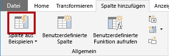

1. Beachten Sie, dass die erste Zeile für das Jahr **2017** und die Monatsnummer **7** ist.

1. Geben Sie in der Spalte **Column1** in der ersten Rasterzelle **7/1/2017**ein, und drücken Sie dann die **EINGABETASTE**.

    *Der virtuelle Computer verwendet regionale US-amerikanische Einstellungen, sodass dieses Datum tatsächlich der 1. Juli 2017 ist. Andere regionale Einstellungen erfordern möglicherweise eine **0** vor dem Datum.*

1. Wie Sie sehen, werden die Rasterzellen mit vorhergesagten Werten aktualisiert.

    *Das Feature hat richtig vorhergesagt, dass Sie Werte aus den Spalten **Year** und **MonthNumber** kombinieren.*

1. Beachten Sie auch die über dem Abfrageraster angezeigte Formel.

     

1. Um die neue Spalte umzubenennen, doppelklicken Sie auf die Spaltenüberschrift **Merged**, und benennen Sie die Spalte in **TargetMonth** um.

1. Entfernen Sie die folgenden Spalten:

    - Year
    - MonthNumber

1. Ändern Sie bei den folgenden Spalten den Datentyp:

    - Bei **Target** in „Feste Dezimalzahl“
    - Bei **TargetMonth** in „Datum“

1. Gehen Sie wie folgt vor, um die Werte in der Spalte **Target** mit 1000 zu multiplizieren: Klicken Sie auf die Spaltenüberschrift **Target**, dann auf der Registerkarte **Transformieren** des Menübands in der Gruppe **Zahlenspalte** auf **Standard**, und wählen Sie **Multiplizieren** aus.

    *Sicherlich erinnern Sie sich daran, dass die Zielwerte als Tausend gespeichert wurden.*

     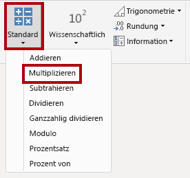

1. Geben Sie im Fenster **Multiplizieren** im Feld **Wert** den Wert **1000** an, und wählen Sie **OK** aus.

1. Überprüfen Sie auf der Statusleiste, ob die Abfrage drei Spalten und 809 Zeilen enthält.

## **Konfigurieren der Abfrage „ColorFormats“**

In dieser Aufgabe konfigurieren Sie die Abfrage **ColorFormats**.

1. Wählen Sie die Abfrage **ColorFormats** aus, und beachten Sie, dass die erste Zeile die Spaltennamen enthält.

1. Klicken Sie auf der Registerkarte **Start** des Menübands in der Gruppe **Transformieren** auf **Erste Zeile als Überschriften verwenden**.

     

1. Überprüfen Sie auf der Statusleiste, ob die Abfrage drei Spalten und zehn Zeilen enthält.

## **Aktualisieren der Abfrage „Product“**

In dieser Aufgabe aktualisieren Sie die Abfrage **Product**, indem Sie sie mit der Abfrage **ColorFormats** zusammenführen.

1. Wählen Sie die Abfrage **Product** aus.

1. Klicken Sie zum Zusammenführen mit der Abfrage **ColorFormats** auf der Registerkarte **Start** des Menübands auf den Nach-unten-Pfeil der Menüoption **Kombinieren** und dann auf **Abfragen zusammenführen**.

    *Das Zusammenführen von Abfragen ermöglicht das Integrieren von Daten, in diesem Fall aus verschiedenen Datenquellen (SQL Server und einer CSV-Datei).*

     

1. Klicken Sie im Fenster **Zusammenführen** im Abfrageraster für **Product** auf die Spaltenüberschrift **Color**.

     

1. Wählen Sie in der Dropdownliste unterhalb des Abfragerasters für **Product** die Abfrage **ColorFormats** aus.

     

1. Klicken Sie im Abfrageraster für **ColorFormats** auf die Spaltenüberschrift **Color**.

1. Wenn das Fenster **Datenschutzebenen** geöffnet wird, wählen Sie dort für jede der beiden Datenquellen in der entsprechenden Dropdownliste **Organisation** und dann **Speichern** aus.

    *Datenschutzebenen können für Datenquellen konfiguriert werden, um festzulegen, ob Daten zwischen Quellen freigegeben werden können. Wenn Sie für alle Datenquellen **Organisation** festlegen, können diese bei Bedarf Daten freigeben. Private Datenquellen können nicht für andere Datenquellen freigegeben werden. Dies bedeutet nicht, dass private Daten überhaupt nicht freigegeben werden können, sondern lediglich, dass die Power Query-Engine keine Daten zwischen den Quellen freigeben kann.*

     

1. Verwenden Sie im Fenster **Zusammenführen** den Standardwert für die **Art des Joins**. Behalten Sie dabei die Auswahl von „Linker äußerer Join“ bei, und klicken Sie auf **OK**.

1. Erweitern Sie die Spalte **ColorFormats**, um die beiden folgenden Spalten hinzuzufügen:

    - Background Color Format
    - Font Color Format

1. Überprüfen Sie auf der Statusleiste, ob die Abfrage acht Spalten und 397 Zeilen enthält.

## **Aktualisieren der Abfrage „ColorFormats“**

In dieser Aufgabe aktualisieren Sie **ColorFormats**, um das Laden für diese Abfrage zu deaktivieren.

1. Wählen Sie die Abfrage **ColorFormats** aus.

1. Klicken Sie im Bereich **Abfrageeinstellungen** auf den Link **Alle Eigenschaften**.

     

1. Deaktivieren Sie im Fenster **Abfrageeigenschaften** das Kontrollkästchen bei **Laden in Bericht aktivieren**.

    *Wenn Sie den Ladevorgang deaktivieren, wird es nicht als Tabelle in das Datenmodell geladen. Dies geschieht, weil die Abfrage mit der **Product**-Abfrage zusammengeführt wurde, die zum Laden in das Datenmodell aktiviert ist.*

     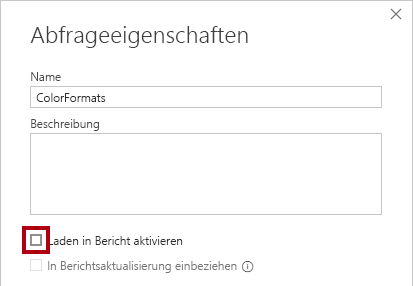

### **Abschluss**

Mit dieser Aufgabe schließen Sie das Lab ab.

1. Stellen Sie sicher, dass Sie über acht Abfragen verfügen, die wie folgt korrekt benannt sind:

    - Salesperson
    - SalespersonRegion
    - Product
    - Reseller
    - Region
    - Sales
    - Targets
    - ColorFormats (wird nicht ins Datenmodell geladen)

1. Klicken Sie in der Backstage-Ansicht **Datei** auf **Schließen &amp; übernehmen**, um das Datenmodell zu laden.

    *Alle Abfragen, für die das Laden aktiviert ist, werden nun in das Datenmodell geladen.*

     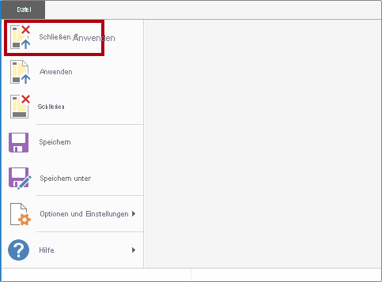

1. Im Bereich **Daten** (auf der rechten Seite) sehen Sie die sieben Tabellen, die in das Datenmodell geladen wurden.

     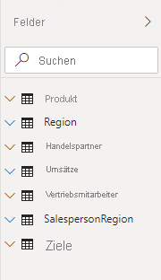

1. Speichern Sie die Power BI Desktop-Datei.

*Sie konfigurieren Datenmodelltabellen und -beziehungen im Lab **Modellieren von Daten in Power BI Desktop***.
